# Multi-Tenant Community Management System


A full-stack web application designed to simplify the management of residential societies by providing dedicated portals for **Admins**, **Residents**, and **Guards**. The platform streamlines visitor management, complaint handling, community communication, resident directory management, and maintenance fee collection while ensuring complete society-level data isolation through a multi-tenant architecture.

---

## Features

### Authentication

* JWT-based authentication
* Role-based authorization
* Multi-tenant society isolation
* Secure password hashing using Bcrypt

### Admin Portal

* Manage community announcements
* Manage resident directory
* View and manage visitors
* Handle complaints and tickets
* Generate monthly maintenance dues
* Configure society payment settings
* Track maintenance payments

### Resident Portal

* View community announcements
* Access resident directory
* Raise and track complaints
* View visitor history
* Pay monthly maintenance dues
* View payment history

### Guard Portal

* Register visitor entries
* Record visitor exits
* Monitor active visitors

---

## Tech Stack

### Frontend

* React
* Vite
* React Router
* Axios

### Backend

* Node.js
* Express.js
* JWT
* Bcrypt

### Database

* MySQL

### Payment Integration

* Razorpay API (Society-specific configuration)

---

## Project Structure

```text
Community-Management-System/
│
├── community-frontend/
│   ├── src/
│   │   ├── components/
│   │   ├── context/
│   │   ├── pages/
│   │   ├── services/
│   │   └── App.jsx
│   └── package.json
│
├── community-backend/
│   ├── controllers/
│   ├── middleware/
│   ├── routes/
│   ├── config/
│   ├── server.js
│   └── package.json
│
└── README.md
```

---

## Database Design

The application follows a **multi-tenant architecture**, ensuring every society can securely access only its own data.

### Core Entities

* Societies
* Users
* Flats
* Visitors
* Community Posts
* Tickets
* Monthly Dues
* Payments

---

## Installation

### Clone the Repository

```bash
git clone https://github.com/your-username/communityhub.git
cd communityhub
```

### Backend Setup

```bash
cd community-backend
npm install
```

Create a `.env` file inside the backend directory:

```env
PORT=5000

DB_HOST=localhost
DB_USER=root
DB_PASSWORD=your_password
DB_NAME=community_v2_app

JWT_SECRET=your_secret_key
```

Start the backend server:

```bash
npm run dev
```

### Frontend Setup

```bash
cd community-frontend
npm install
npm run dev
```

---

## User Roles

| Role         | Capabilities                                                                                      |
| ------------ | ------------------------------------------------------------------------------------------------- |
| **Admin**    | Manage residents, visitors, tickets, community posts, finances, and society payment settings      |
| **Resident** | View announcements, access directory, raise complaints, pay maintenance dues, and manage visitors |
| **Guard**    | Register visitor entries, record exits, and monitor active visitors                               |

---

## Security Features

* JWT-based authentication
* Password hashing using Bcrypt
* Protected API routes
* Role-based access control
* Society-level data isolation
* Secure payment verification

---

## Modules

* Authentication
* Dashboard
* Community
* Visitors
* Tickets
* Finances
* Society
* Users

## Screenshots

<p align="center">
  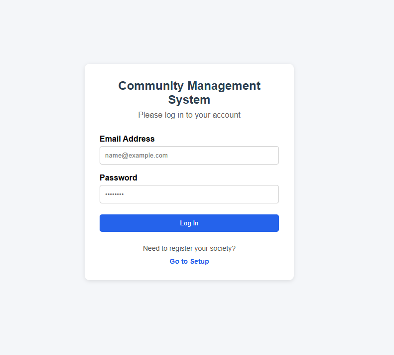
  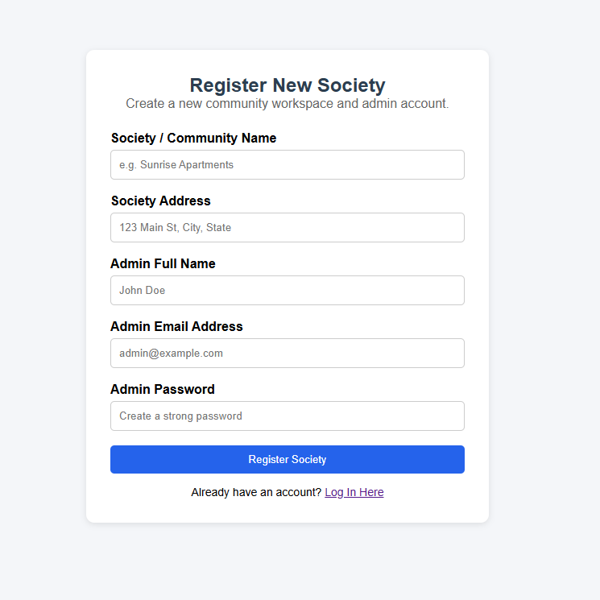
</p>

<p align="center">
  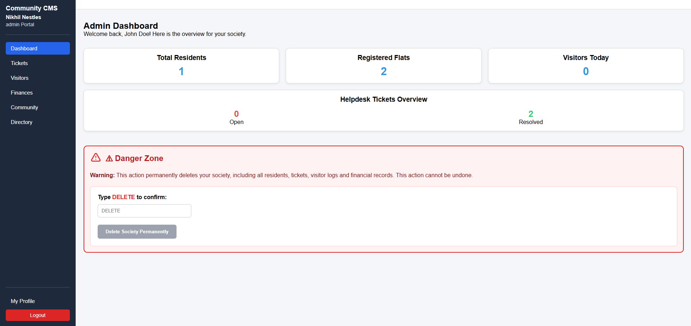
  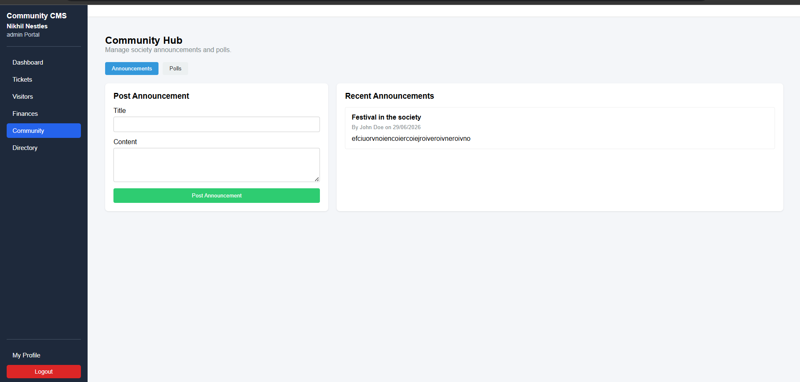
</p>

<p align="center">
  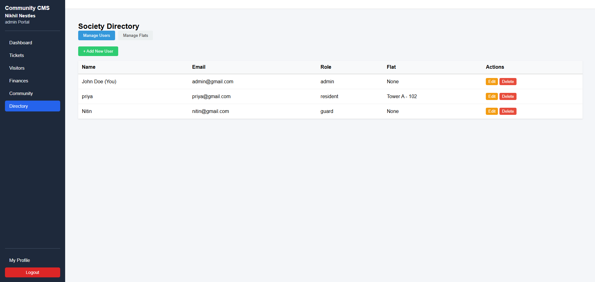
  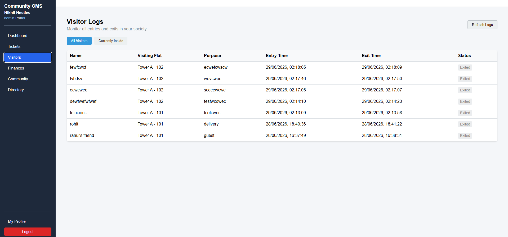
</p>

<p align="center">
  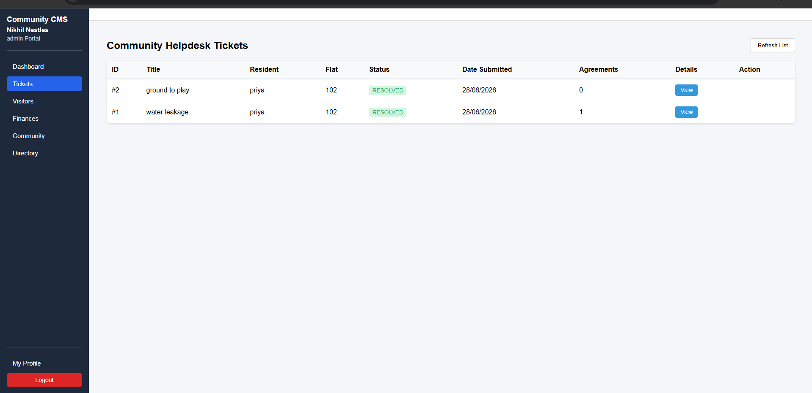
  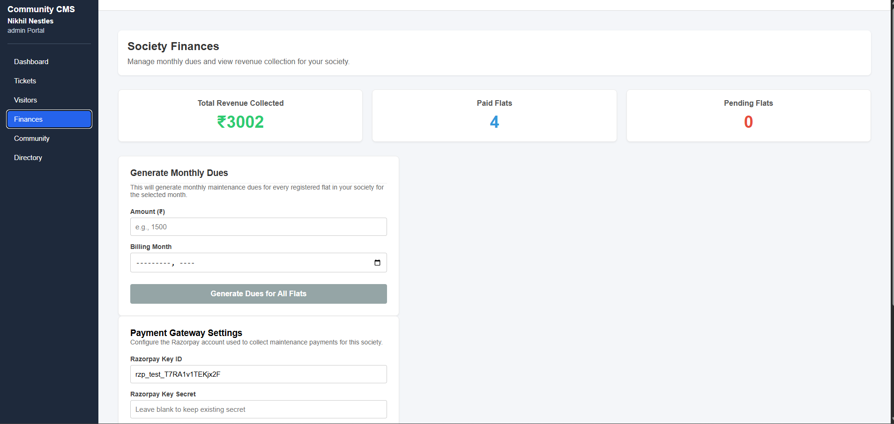
</p>

<p align="center">
  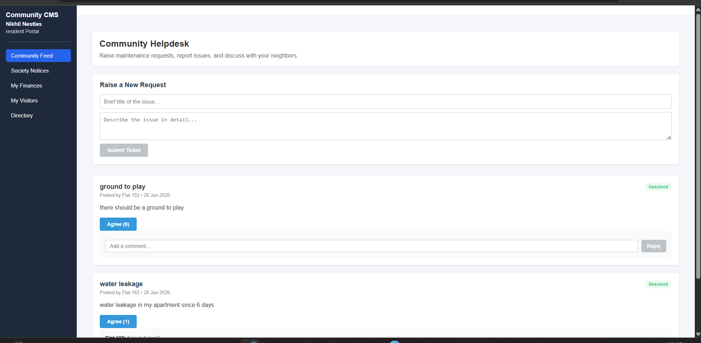
  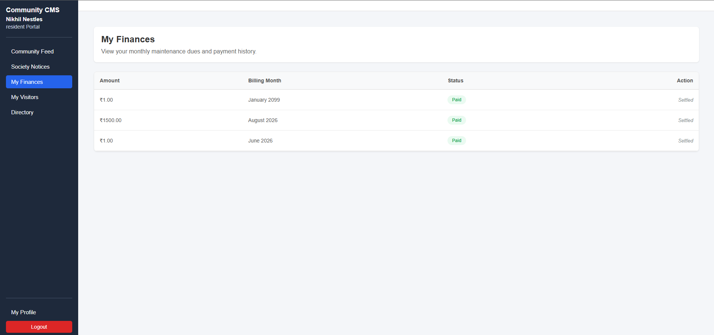
</p>

<p align="center">
  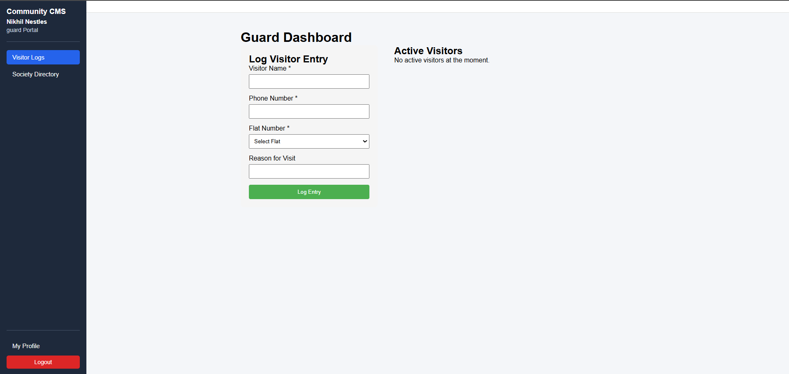
  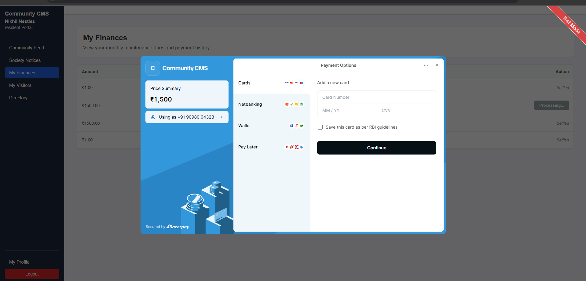
</p>